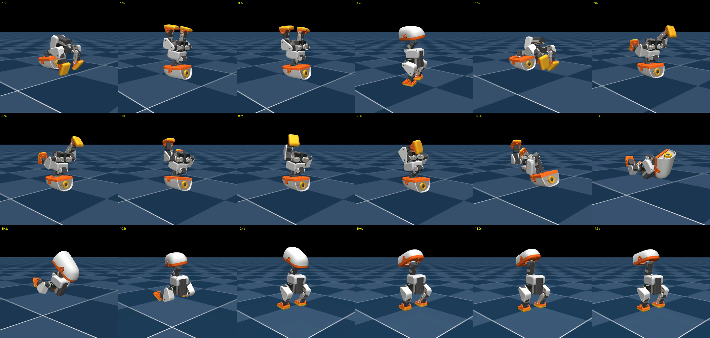

# Microduck headstand

An acrobatic headstand routine for Microduck, trained and evaluated in simulation.

The duck folds forward from standing, kicks up to a headstand with its legs together, holds, and rolls back onto its feet. It then folds again, enters a split headstand, switches which leg leads, and continues over in the split to return to standing.

The routine combines six trained policies with Pollen's standing policy. Each policy takes over after the duck has held the preceding position. The training tasks, rewards, and configuration reference are in [`microduck_rl/docs/headstand/README.md`](microduck_rl/docs/headstand/README.md).

## Results

The routine passed **87/96 attempts** across three seeds, with a median completion time of **12.3 seconds**. Each of the six individual policies passed **32/32**. The evaluation reports and raw logs are in [`results/verified/`](results/verified/). The evaluator requires the intended leg position during the headstand holds, completion of every stage, and standing on both feet at the final frame. It disables automatic resets and records explicit random seeds and checkpoint hashes.

Earlier videos illustrate the movement but were recorded before these checks were tightened. Their historical counts are retained in [`results/README.md`](results/README.md), separately from the verified results.

[Watch the earlier routine video](results/routine/routine_full_v15_splitover.mp4)



All results are from simulation. The routine has not been tested on the physical robot.

## Run the evaluation

Clone with submodules, then install the training environment:

```bash
git clone --recurse-submodules https://github.com/zachgarner/microduck-headstand.git
cd microduck-headstand/microduck_rl
uv sync
```

Download the six evaluated checkpoints and Pollen's standing policy without logging in:

```bash
uv run ../tools/download_policies.py
```

The downloader uses pinned Hugging Face revisions, verifies SHA-256 hashes against the evaluation evidence, and places each file in the evaluator's cache. W&B access is not required. Each published headstand package also contains a normalized ONNX export, provenance, and an individual evaluation report. The success counts were measured with the original checkpoints; the ONNX exports passed shape and output checks, but were not separately evaluated in full rollouts. These are simulation artifacts, not robot-daemon installation packages.

| Policy | Public package |
| --- | --- |
| fold | [Hugging Face](https://huggingface.co/ZachGarner/microduck-headstand-fold/tree/a889f49599a658c1c6ca780e446ed98c381b4093) |
| legs-together | [Hugging Face](https://huggingface.co/ZachGarner/microduck-headstand-legs-together/tree/910d72cb6ccb2bf3db523b5e2d3916b6afb563dd) |
| split | [Hugging Face](https://huggingface.co/ZachGarner/microduck-headstand-split/tree/ba7289f31f2f23d02f67f39b26bd512653fdee04) |
| switch | [Hugging Face](https://huggingface.co/ZachGarner/microduck-headstand-switch/tree/1cbf2592b61cb58ac3bb6ec4d5d6318e3b34f209) |
| backroll | [Hugging Face](https://huggingface.co/ZachGarner/microduck-headstand-backroll/tree/aef59e138f3dc6cebc67d809e293e6908146d783) |
| splitover | [Hugging Face](https://huggingface.co/ZachGarner/microduck-headstand-splitover/tree/a988bb01dcaea5487ab9f63228f4bea232993b36) |

Run three seeds with 32 attempts each, plus the individual policy checks:

```bash
uv run ../tools/run_verification.py --routine-seeds 0 1 2 --individual --workers 2
```

To record a routine, use the same checkpoints and settings:

```bash
uv run ../tools/routine_full.py \
  --fold vorty4kb:model_1000.pt --legs-together gx4v9lcz:model_1499.pt \
  --roll ax1vgv8z:model_1999.pt --split y2fllvgj:model_1499.pt \
  --switch whv1lcu7:model_500.pt --switch-hold-s 1 --single-switch \
  --splitover 2v46kg6g:model_1499.pt --stand policies/pollen/alpha_stand.onnx \
  --hold-s 2 --settle-s 1 --pike-settle-s 0 --episodes 32 --seconds 18 \
  --seed 0 --json ../results/routine-video.json --video routine.mp4
```

The video shows the first environment. The JSON report covers all attempts.

## Training and repository layout

Training uses PPO in mjlab, with the `allcollisions` robot model and BAM actuators. The policies share 61 observation values and control 14 joints at 50 Hz. Shared observation dimensions alone do not establish that the simulation's contact-based handovers are available on hardware.

The fold and kick-ups train separately. Recorded fold handovers give the kick-ups practice from positions the preceding policy produces. Some training episodes begin partway through the movement or in the headstand, allowing balance to develop before the full entrance is reliable.

| Directory | Contents |
| --- | --- |
| `microduck_rl/` | Training repository, included as a submodule. |
| `tools/` | Evaluation scripts, regression tests, and an explicit factory-configuration training wrapper. |
| `results/verified/` | Current seeded evaluation reports and logs. |
| `results/routine/`, `results/policies/` | Historical videos and frame strips. |
| `physics/` | Pose and contact experiments used during development. |
| `anyscale/` | Historical training records and job submission tools. |

See [`tools/README.md`](tools/README.md) for success criteria and [`anyscale/README.md`](anyscale/README.md) for training settings and current commands.
