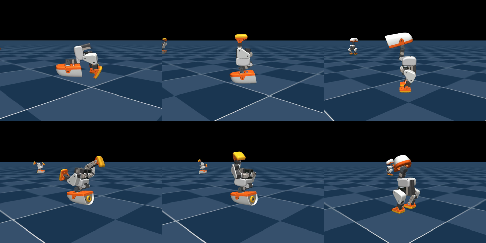
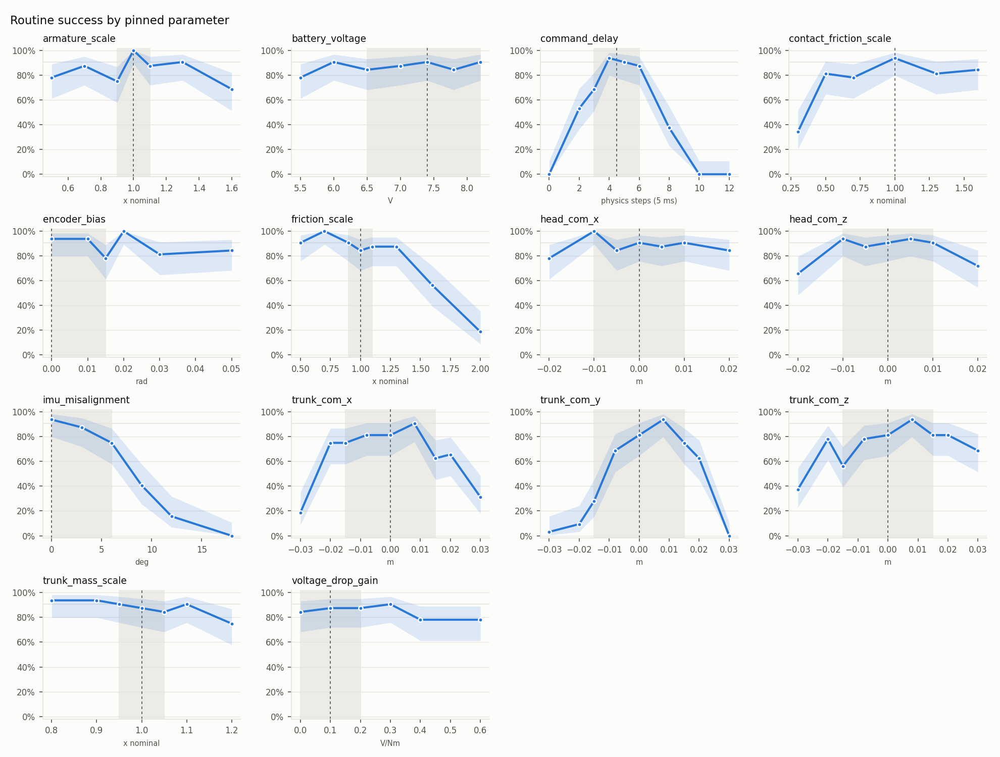

# Microduck headstand

An acrobatic headstand routine for Microduck, trained and evaluated in simulation.

The duck folds forward from standing, kicks up to a headstand with its legs together, holds, and rolls back onto its feet. It then folds again, enters a split headstand, switches which leg leads, and continues over in the split to return to standing.

The routine combines six trained policies with Pollen's standing policy. Each policy takes over after the duck has held the preceding position. The training tasks, rewards, and configuration reference are in [`microduck_rl/docs/headstand/README.md`](microduck_rl/docs/headstand/README.md).

## Results

The routine passed **87/96 attempts** across three seeds, with a median completion time of **12.3 seconds**. Each of the six individual policies passed **32/32**. The evaluation reports and raw logs are in [`results/verified/`](results/verified/). The evaluator requires the intended leg position during the headstand holds, completion of every stage, and standing on both feet at the final frame. It disables automatic resets and records explicit random seeds and checkpoint hashes.

The latest routine recording is **v16** below. It demonstrates one simulated attempt; the 87/96 count comes from the separate seeded evaluation reports. Earlier recordings and their historical counts are retained in [`results/README.md`](results/README.md).

[Watch the latest routine video — v16](results/routine/routine_full_v16_strict.mp4)



All results are from simulation. The routine has not been tested on the physical robot.

## Robustness

The 87/96 score draws each physics parameter at random from a narrow range. Pinning one parameter at a time across a grid shows where the routine breaks. We ran 14 parameters, 32 full-routine attempts per value, 3,296 attempts in all. Every other parameter kept its random draw.



- **Command delay.** The policies trained with a servo command delay of 15 to 30 ms. They succeed about 90% at 20 to 25 ms, 0/32 with no delay, and 0/32 at 50 ms or more. The real robot's latency has to fall inside that band.
- **Sideways trunk center of mass.** A 15 mm offset to one side drops the routine to 28% (75% to the other side), and most of those failures stop at the leg switch. The checkpoints probably trained with offsets of only ±5 to ±10 mm. The evaluation behind 87/96 drew offsets from ±3 mm.
- **IMU misalignment.** Success falls to 75% at 6°, the training maximum, and 41% at 9°.
- **Joint friction** above 1.3 times nominal degrades the back roll: 19% at twice nominal.
- **Backlash** up to 4° of gear play makes no difference, though the policies never trained with it.

Perturbing the state handed between policies shows that the second fold fails from a stand tilted back 10°, and the legs-together kick-up fails from a pike tilted forward 10° or more. The findings and their caveats are tracked in [zachgarner/microduck_rl#13](https://github.com/zachgarner/microduck_rl/issues/13), [#14](https://github.com/zachgarner/microduck_rl/issues/14) and [#15](https://github.com/zachgarner/microduck_rl/issues/15). Each sweep's map, records and provenance are in [`results/sweeps/`](results/sweeps/). The sweep harness and how to run it on Anyscale are in [`tools/sweep/`](tools/sweep/README.md).

## Run the evaluation

Clone with submodules, then install the training environment:

```bash
git clone --recurse-submodules https://github.com/zachgarner/microduck-headstand.git
cd microduck-headstand/microduck_rl
uv sync
```

Download the six evaluated checkpoints and Pollen's standing policy without logging in:

```bash
uv run ../tools/download_policies.py
```

The downloader uses pinned Hugging Face revisions, verifies SHA-256 hashes against the evaluation evidence, and places each file in the evaluator's cache. W&B access is not required. Each published headstand package also contains a normalized ONNX export, provenance, and an individual evaluation report. The success counts were measured with the original checkpoints; the ONNX exports passed shape and output checks, but were not separately evaluated in full rollouts. These are simulation artifacts, not robot-daemon installation packages.

| Policy | Public package |
| --- | --- |
| fold | [Hugging Face](https://huggingface.co/ZachGarner/microduck-headstand-fold/tree/a889f49599a658c1c6ca780e446ed98c381b4093) |
| legs-together | [Hugging Face](https://huggingface.co/ZachGarner/microduck-headstand-legs-together/tree/910d72cb6ccb2bf3db523b5e2d3916b6afb563dd) |
| split | [Hugging Face](https://huggingface.co/ZachGarner/microduck-headstand-split/tree/ba7289f31f2f23d02f67f39b26bd512653fdee04) |
| switch | [Hugging Face](https://huggingface.co/ZachGarner/microduck-headstand-switch/tree/1cbf2592b61cb58ac3bb6ec4d5d6318e3b34f209) |
| backroll | [Hugging Face](https://huggingface.co/ZachGarner/microduck-headstand-backroll/tree/aef59e138f3dc6cebc67d809e293e6908146d783) |
| splitover | [Hugging Face](https://huggingface.co/ZachGarner/microduck-headstand-splitover/tree/a988bb01dcaea5487ab9f63228f4bea232993b36) |

Run three seeds with 32 attempts each, plus the individual policy checks:

```bash
uv run ../tools/run_verification.py --routine-seeds 0 1 2 --individual --workers 2
```

To record a routine, use the same checkpoints and settings:

```bash
uv run ../tools/routine_full.py \
  --fold vorty4kb:model_1000.pt --legs-together gx4v9lcz:model_1499.pt \
  --roll ax1vgv8z:model_1999.pt --split y2fllvgj:model_1499.pt \
  --switch whv1lcu7:model_500.pt --switch-hold-s 1 --single-switch \
  --splitover 2v46kg6g:model_1499.pt --stand policies/pollen/alpha_stand.onnx \
  --hold-s 2 --settle-s 1 --pike-settle-s 0 --episodes 32 --seconds 18 \
  --seed 0 --json ../results/routine-video.json --video routine.mp4
```

The video shows the first environment. The JSON report covers all attempts.

## Training and repository layout

Training uses PPO in mjlab, with the `allcollisions` robot model and BAM actuators. The policies share 61 observation values and control 14 joints at 50 Hz. Shared observation dimensions alone do not establish that the simulation's contact-based handovers are available on hardware.

The fold and kick-ups train separately. Recorded fold handovers give the kick-ups practice from positions the preceding policy produces. Some training episodes begin partway through the movement or in the headstand, allowing balance to develop before the full entrance is reliable.

| Directory | Contents |
| --- | --- |
| `microduck_rl/` | Training repository, included as a submodule. |
| `tools/` | Evaluation scripts, regression tests, and an explicit factory-configuration training wrapper. |
| `tools/sweep/` | The parameter sweep harness, local or on a Ray cluster. |
| `results/sweeps/` | Sweep maps, records, handover states and provenance. |
| `results/verified/` | Current seeded evaluation reports and logs. |
| `results/routine/`, `results/policies/` | Latest routine video, earlier recordings, and frame strips. |
| `physics/` | Pose and contact experiments used during development. |
| `anyscale/` | Historical training records and job submission tools. |

See [`tools/README.md`](tools/README.md) for success criteria and [`anyscale/README.md`](anyscale/README.md) for training settings and current commands.
