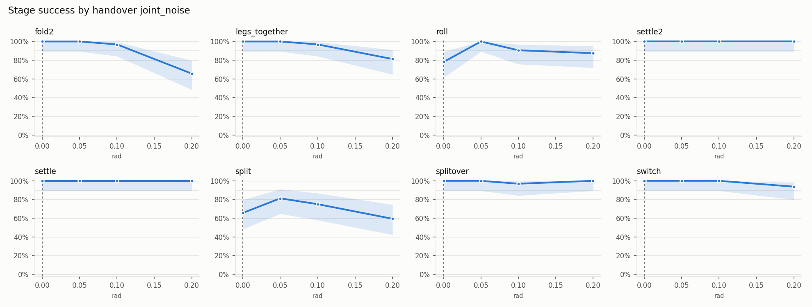

# Stage success by handover joint_noise

Each panel pins one parameter and runs every grid value. The shaded band is the training range, the dashed line the nominal value, and the grey line the baseline, 90%.

The failure edge is the first value, moving outward from nominal, whose 95% interval lies entirely below the baseline.

| Axis | Training range | Lower failure edge | Upper failure edge | Worst success inside the training range | All attempts | Most common first unfinished stages |
| --- | --- | --- | --- | ---: | ---: | --- |
| fold2 (rad) | not randomized | none in grid | 0.2 | 100% | 116/128 |  |
| legs_together (rad) | not randomized | none in grid | none in grid | 100% | 121/128 |  |
| roll (rad) | not randomized | none in grid | none in grid | 78% | 114/128 |  |
| settle2 (rad) | not randomized | none in grid | none in grid | 100% | 128/128 |  |
| settle (rad) | not randomized | none in grid | none in grid | 100% | 128/128 |  |
| split (rad) | not randomized | none in grid | 0.1 | 66% | 90/128 |  |
| splitover (rad) | not randomized | none in grid | none in grid | 100% | 127/128 |  |
| switch (rad) | not randomized | none in grid | none in grid | 100% | 126/128 |  |
